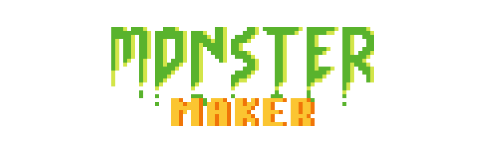

## Monster Maker

Monster Maker is a mobule and web dApp ( distributed application ) on [Flow Blockchain](https://onflow.org) that allows users to connect a wallet, sign a transaction to mint an NFT (a monster) and display their collection of NFTs (their monsters) within the app. It’s meant to be a lightweight sample project to exemplify how to build a mobile or web dApp Flow project.

## Project Structure

Before we get started, here is general overview about the Monster Maker monorepo structure.

- `cadence` folder is where the smart contract, transaction and query located, you can use [Flow CLI](https://developers.flow.com/tools/emulator/index) to deploy NFT contract.
- `iOS` folder contains all the swift code to examplify how to build mobile dApp on Flow Blockchain
- `server` folder will guide you how to build a web dApp and API on Flow